<div align="center">


[](https://git.io/typing-svg)


<p>
  <a href="https://eduardolucas.lat" target="_blank"></a>
  <a href="mailto:lucas1617y@gmail.com"></a>
  <a href="https://linkedin.com/in/tu-perfil"></a>
</p>

</div>

---


## 👋 Sobre mí

```javascript
const eduardo = {
  nombre: "Fredhy Eduardo Rosas Lucas",
  rol: "Desarrollador Full Stack · Ingeniero de Sistemas",
  ubicacion: "Perú 🇵🇪",
  educacion: "Ingeniería de Sistemas, egresado UNHEVAL",
  intereses: ["Diseño", "Programación", "Arquitectura de software", "IA aplicada"],
  descripcion: "Diseño, desarrollo y despliegue de aplicaciones web y móviles",
  stack: ["Next.js", "React", "Flutter", "NestJS", "PostgreSQL", "Python"],
  premios: ["Semilleros UNHEVAL 2023", "InspiraTEC 2024", "Semilleros UNHEVAL 2025"],
  contacto: "lucas1617y@gmail.com",
  pronombres: "Lucsducks 😶‍🌫️"
};
```

---

## 🛠️ Tech Stack

<table>
<tr>
<td align="center" width="96">
  
  <br>TypeScript
</td>
<td align="center" width="96">
  
  <br>JavaScript
</td>
<td align="center" width="96">
  
  <br>Dart
</td>
<td align="center" width="96">
  
  <br>React
</td>
<td align="center" width="96">
  
  <br>Next.js
</td>
<td align="center" width="96">
  
  <br>Flutter
</td>
</tr>
<tr>
<td align="center" width="96">
  
  <br>Node.js
</td>
<td align="center" width="96">
  
  <br>NestJS
</td>
<td align="center" width="96">
  
  <br>PostgreSQL
</td>
<td align="center" width="96">
  
  <br>MongoDB
</td>
<td align="center" width="96">
  
  <br>Docker
</td>
<td align="center" width="96">
  
  <br>Git
</td>
</tr>
</table>

---

## 📊 Estadísticas

<div align="center">

<table>
  <tr>
    <td width="50%">
      
    </td>
    <td width="50%">
      
    </td>
  </tr>
  <tr>
    <td width="50%">
      
    </td>
    <td width="50%">
      
    </td>
  </tr>
</table>

</div>

---

## 🚀 Proyectos destacados

| Proyecto | Descripción | Tech |
|----------|-------------|------|
| [**IziFile**](https://izifile.eduardolucas.lat) | Transferencia segura SFTP/SSH | Flutter, Node.js, MongoDB |
| [**Mishisimi**](https://mishisimi.eduardolucas.lat) | Aprende quechua con IA 🎓 | Flutter, NestJS, Gemini |
| [**LexLink**](https://lexlink.eduardolucas.lat) | Plataforma legal + asistentes IA | React, NestJS, PostgreSQL |
| [**Eley**](https://github.com/lucsducks/eley) | Asistencia discapacidad visual | Flutter, Deep Learning |
| [**Handin**](https://handin.pro) | Plataforma educativa tipo Teleticket | Next.js, NestJS |
| [**Solagri**](https://wsp.solagri.space) | Chatbot WhatsApp + IA (Ollama) | NestJS, React, Evolution API |

---

## 🌱 Actualmente

- 🌐 **Handin** — Plataforma educativa de venta de entradas y cursos
- 📱 **Eley** — Sistema de asistencia para personas con discapacidad visual
- 🤖 **IA aplicada** — Integración con Gemini, Ollama
- 🏗️ **Arquitectura de software** — APIs, metodologías ágiles, buenas prácticas

---

## 📫 Contacto

<p align="center">
  <a href="mailto:lucas1617y@gmail.com"></a>
  <a href="https://eduardolucas.lat"></a>
  <a href="https://github.com/lucsducks"></a>
</p>

<div align="center">

*Pronouns: Lucsducks · 😶‍🌫️*


</div>
