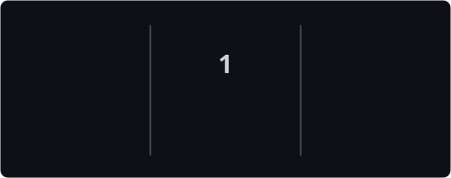
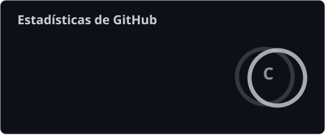
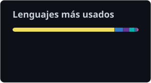

<div align="center">


<a href="https://eduardolucas.lat/"></a>
<a href="mailto:lucas1617y@gmail.com"></a>
<a href="https://github.com/lucsducks?tab=repositories"></a>

</div>

## 👨‍💻 Un poco de mí

Soy Lucas, ingeniero de sistemas de Perú. Trabajo en **Rapitech** creando apps, agentes de IA e integraciones con Odoo. Me gusta moverme entre el diseño, el código y ese momento en que todo por fin funciona junto.

```typescript
const lucas = {
  alias: "lucsducks",
  desde: "Perú 🇵🇪",
  construyendo: ["Agentes de IA", "Apps web y móviles", "Integraciones ERP"],
  explorando: ["Voz en tiempo real", "Memoria para agentes", "Modelos locales"],
  formaDeTrabajar: "Probar, revisar y mejorar",
};
```

## ⚡ En lo que ando

<table>
<tr>
<td width="50%" valign="top">

### 🤖 IA que hace cosas

Agentes conectados a herramientas, con memoria y flujos de trabajo. También exploro voz en tiempo real y coordinación entre agentes.

</td>
<td width="50%" valign="top">

### 🔗 Odoo + automatización

Módulos e integraciones para conectar procesos de negocio con aplicaciones y servicios de IA.

</td>
</tr>
<tr>
<td width="50%" valign="top">

### 📱 Apps de punta a punta

Flutter para móvil, React y Next.js para web. Del diseño de la interfaz a las APIs y los datos.

</td>
<td width="50%" valign="top">

### 🛠️ Herramientas para construir

Contexto de código, trabajo multiagente, pruebas y CI/CD. Buscando que desarrollar y desplegar sea menos complicado.

</td>
</tr>
</table>

## 🧩 Mi caja de herramientas

<div align="center">

**Web & móvil**


**Backend & datos**


**Del código al despliegue**


<br /><br />


</div>

## 📊 Por aquí en GitHub

<div align="center">



<br />




<sub>También trabajo en GitLab y repos privados. Estas tarjetas solo muestran una parte 🙂</sub>

</div>

<br />

<div align="center">

### ¿Hablamos de código, apps o agentes? 👋

[**eduardolucas.lat**](https://eduardolucas.lat/) · [**lucas1617y@gmail.com**](mailto:lucas1617y@gmail.com)


</div>
